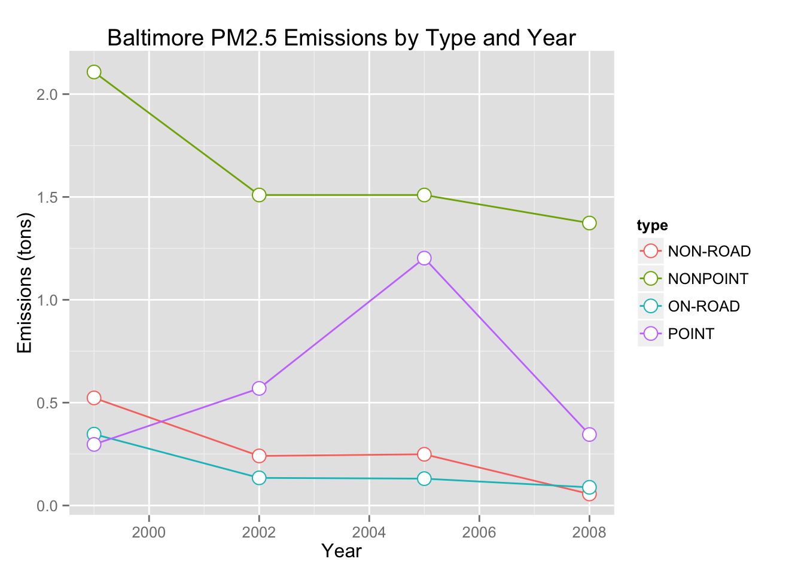
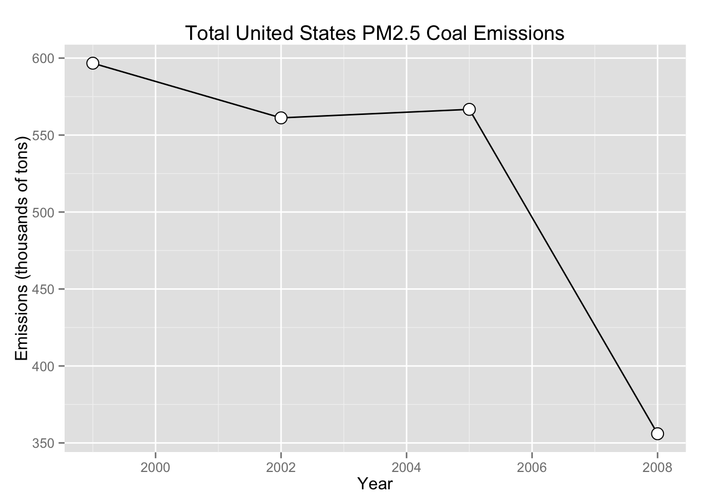
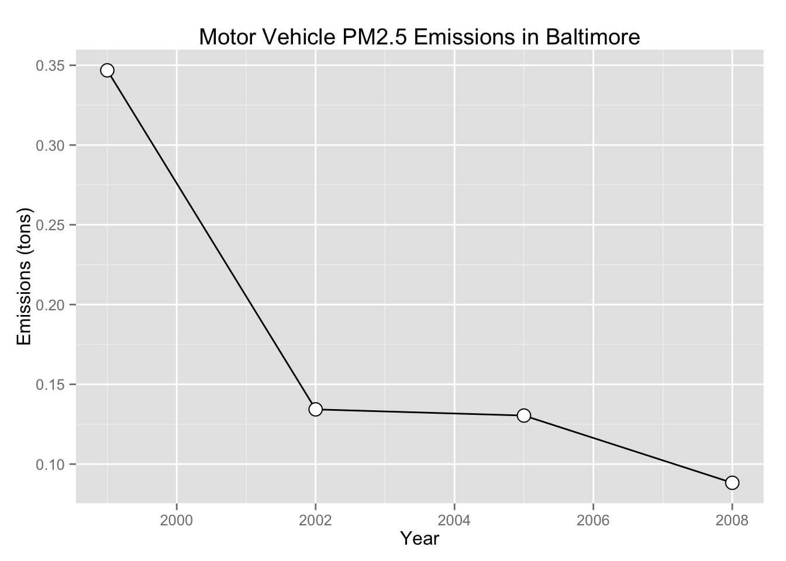

# Plotting Coal Emissions
Daniel Maurath  
June, 2014  

####About
This was a project for the **Exploratory Data Analysis** course in Coursera's Data Science specialization track. The objective was to practice reshaping and plotting data as well as how to make decisions how to interpret and present data. 

###Synopsis
Fine particulate matter (PM2.5) is an ambient air pollutant for which there is strong evidence that it is harmful to human health. In the United States, the Environmental Protection Agency (EPA) is tasked with setting national ambient air quality standards for fine PM and for tracking the emissions of this pollutant into the atmosphere. Approximately every 3 Years, the EPA releases its database on emissions of PM2.5. This database is known as the National Emissions Inventory (NEI). 

For each Year and for each type of PM source, the NEI records how many tons of PM2.5 were emitted from that source over the course of the entire Year. The data used for this project are for 1999, 2002, 2005, and 2008.

The following analysis will answer 6 Questions proposed in the assignment. Plots are produced to support the answers.

###Data
The data for this assignment is available from the course web site as a single zip file:

[Data for Peer Assessment (29Mb)](https://d396qusza40orc.cloudfront.net/exdata%2Fdata%2FNEI_data.zip)

The zip file contains two files:
* SCC_PM25.rds
* Source_Classification_Code.rds

####SCC_PM25.rds
````
##     fips      SCC Pollutant Emissions  type Year
## 4  09001 10100401  PM25-PRI    15.714 POINT 1999
## 8  09001 10100404  PM25-PRI   234.178 POINT 1999
## 12 09001 10100501  PM25-PRI     0.128 POINT 1999
## 16 09001 10200401  PM25-PRI     2.036 POINT 1999
## 20 09001 10200504  PM25-PRI     0.388 POINT 1999
## 24 09001 10200602  PM25-PRI     1.490 POINT 1999
````
* `fips:` A five-digit number (represented as a string) indicating the U.S. county

* `SCC:` The name of the source as indicated by a digit string (see source code classification table)

* `Pollutant:` A string indicating the pollutant

* `Emissions:` Amount of PM2.5 emitted, in tons

* `type:` The type of source (point, non-point, on-road, or non-road)

* `Year:` The Year of emissions recorded

####Source_Classification_Code.rds
This table provides a mapping from the SCC digit strings in the Emissions table to the actual name of the PM2.5 source. The sources are categorized in a few different ways from more general to more specific.

####Reading .rds Data
You can read each of the two files using the readRDS() function in R. For example, reading in each file can be done with the following code:
```
* NEI <- readRDS("summarySCC_PM25.rds") [This first line will likely take a few seconds. Be patient!]
* SCC <- readRDS("Source_Classification_Code.rds")
as long as each of those files is in your current working directory (check by calling dir() and see if those files are in the listing).
```

###Code

####Load Packages

```r
library(plyr) 
library(reshape2)
library(ggplot2)
```

####Load and Merge Data.
Data is downloaded, unzipped, and each file is loaded as its own data frame. Emissions is converted from "tons" to "thousands of tons" for easier plotting. Year column is capitalized. 

```r
if(!file.exists("exdata-data-NEI_data.zip")) {
        temp <- tempfile()
        download.file("http://d396qusza40orc.cloudfront.net/exdata%2Fdata%2FNEI_data.zip",temp)
        unzip(temp)
        unlink(temp)
}

NEI <- readRDS("summarySCC_PM25.rds") 
SCC <- readRDS("Source_Classification_Code.rds")
df <- subset(SCC, select = c("SCC", "Short.Name"))
NEI_SCC <- merge(NEI, df, by.x="SCC", by.y="SCC", all=TRUE)

NEI_SCC$Emissions <- NEI_SCC$Emissions/1000
NEI_SCC <- rename(NEI_SCC, c("year"="Year"))
```

>**Question 1**: Have total emissions from PM2.5 decreased in the United States from 1999 to 2008?

>**Answer**: Yes total emissions from PM2.5 decreased in the United States from 1999 to 2008 have decreased.

Aggregate the total PM2.5 emission from all sources for each of the Years 1999, 2002, 2005, and 2008.

```r
plot_1 <- aggregate(Emissions ~ Year, NEI_SCC, sum)
```

Then create the plot:
* Y-axis: Emissions (thousand tons)
* X-axis: Year
* Title: "Total US PM2.5 Emissions"
* Suppress X-axis labels

```r
plot(plot_1$Year,plot_1$Emissions, main="Total US PM2.5 Emissions", "b", xlab="Year", ylab="Emissions (thousands of tons)",xaxt="n")
axis(side=1, at=c("1999", "2002", "2005", "2008"))
```

 

```r
par(mar=c(5.1,5.1,4.1,2.1))
dev.copy(png, file="plot_1.png", width=720, height=480)
```

```
## quartz_off_screen 
##                 3
```

```r
dev.off()
```

```
## pdf 
##   2
```

>**Question 2**: Have total emissions from PM2.5 decreased in the Baltimore City, Maryland (fips == "24510") from 1999 to 2008?

>**Answer**: Yes, overall total emissions from PM2.5 have decreased in Baltimore City, Maryland from 1999 to 2008.
Subset data for only Baltimore observations

```r
plot_2 <- subset(NEI_SCC, fips == "24510", c("Emissions", "Year","type"))
```
Sum Emissions for each Year.

```r
plot_2 <- aggregate(Emissions ~ Year, plot_2, sum)
```
Create Plot Graphic
* Y-axis: Emissions (thousand tons)
* X-axis: Year
* Title: "Total Baltimore PM2.5 Emissions"
* Suppress X-axis labels

```r
plot(plot_2$Year,plot_2$Emissions, main="Total Baltimore PM2.5 Emissions", "b", xlab="Year", ylab="Emissions (thousand tons)",xaxt="n")
axis(side=1, at=c("1999", "2002", "2005", "2008"))
```

 

```r
par(mar=c(5.1,4.1,5.1,2.1))
dev.copy(png, file="plot_2.png", width=720, height=480)
```

```
## quartz_off_screen 
##                 3
```

```r
dev.off()
```

```
## pdf 
##   2
```

>**Question 3**: Of the four types of sources indicated by the type (point, nonpoint, onroad, nonroad) variable, which of these four sources have seen decreases in emissions from 1999–2008 for Baltimore City? Which have seen increases in emissions from 1999–2008?

>**Answer**:The `non-road`, `nonpoint`, `on-road` sources decreased emissions overall from 1999 to 2008. `point` has seen increases

Subset data for only Baltimore observations

```r
plot_3 <- subset(NEI_SCC, fips == "24510", c("Emissions", "Year","type"))
```
Melt data and reshape data, summing Emissions by Year then type.

```r
plot_3 <- melt(plot_3, id=c("Year", "type"), measure.vars=c("Emissions"))
plot_3 <- dcast(plot_3, Year + type ~ variable, sum)
```
Plot data with ggplot2
* X-Axis: Year
* Y-Axis: Emissions (tons)
* Grouped by "type" with different colored line per type
* Draw lines
* Define point size, shape, and color
* Add axis labels and title
* Output plot to file

```r
        ggplot(data=plot_3, aes(x=Year, y=Emissions, group=type, color=type)) + geom_line() + geom_point( size=4, shape=21, fill="white") + xlab("Year") + ylab("Emissions (tons)") + ggtitle("Baltimore PM2.5 Emissions by Type and Year")
```

 

```r
        ggsave(file="plot_3.png")
```

```
## Saving 7 x 5 in image
```

>**Question 4**: Across the United States, how have emissions from coal combustion-related sources changed from 1999–2008?

>** Answer**: Emissions from coal combustion related sources have decreased.

Subset data where Short.Name—which indicates emissions source—contains 'Coal'. I made a decision to use a strict definition of Coal to capture the two Coal related categories listed [here](http://www.epa.gov/air/emissions/basic.htm) under Fuel Combustion.

```r
plot_4 <- subset(NEI_SCC, grepl('Coal',NEI_SCC$Short.Name, fixed=TRUE), c("Emissions", "Year","type", "Short.Name"))
```
Aggregate data by Year

```r
plot_4 <- aggregate(Emissions ~ Year, plot_4, sum)
```
Plot data with ggplot2
* X-Axis: Year
* Y-Axis: Emissions (thousands of tons)
* Grouped by "type" with different colored line per type
* Draw lines
* Define point size, shape, and color
* Add axis labels and title
* Output plot to file

```r
ggplot(data=plot_4, aes(x=Year, y=Emissions)) + geom_line() + geom_point( size=4, shape=21, fill="white") + xlab("Year") + ylab("Emissions (thousands of tons)") + ggtitle("Total United States PM2.5 Coal Emissions")
```

 

```r
ggsave(file="plot_4.png")
```

```
## Saving 7 x 5 in image
```

>**Question 5**: How have emissions from motor vehicle sources changed from 1999–2008 in Baltimore City?

>**Answer**: Emissions from motor vehicle sources have decreased from 1999-2008.

Subset data for Baltimore and emissions that occurred on the road. The type ON-ROAD was used as an indicator of motor vehicle emissions. 

```r
plot_5 <- subset(NEI_SCC, fips == "24510" & type =="ON-ROAD", c("Emissions", "Year","type"))
```
Aggregate data by Year.

```r
plot_5 <- aggregate(Emissions ~ Year, plot_5, sum)
```
Plot data with ggplot2
* X-Axis: Year
* Y-Axis: Emissions (thousands of tons)
* Grouped by "type" with different colored line per type
* Draw lines
* Define point size, shape, and color
* Add axis labels and title
* Output plot to file

```r
ggplot(data=plot_5, aes(x=Year, y=Emissions)) + geom_line() + geom_point( size=4, shape=21, fill="white") + xlab("Year") + ylab("Emissions (tons)") + ggtitle("Motor Vehicle PM2.5 Emissions in Baltimore")
```

 

```r
ggsave(file="plot_5.png")
```

```
## Saving 7 x 5 in image
```
>**Question 6**: Compare emissions from motor vehicle sources in Baltimore City with emissions from motor vehicle sources in Los Angeles County, California (fips == "06037"). Which city has seen greater changes over time in motor vehicle emissions?

>**Answer**: Los Angeles has seen the greatest overall change, with a sharp decrease in emissions from 2005 to 2008.

Subset for Los Angeles and Baltimore, again using ON-ROAD type as indicator of motor vehicle emissions. 

```r
plot_6 <- subset(NEI_SCC, (fips == "24510" | fips == "06037") & type =="ON-ROAD", c("Emissions", "Year","type", "fips"))
```
Rename "fips" to city

```r
plot_6 <- rename(plot_6, c("fips"="City"))
```
Rename city labels for more descriptive plotting

```r
plot_6$City <- factor(plot_6$City, levels=c("06037", "24510"), labels=c("Los Angeles, CA", "Baltimore, MD"))
```
Melt data for reshaping

```r
plot_6 <- melt(plot_6, id=c("Year", "City"), measure.vars=c("Emissions"))
```
Reshape data summing emissions by city (i.e. City) then Year

```r
plot_6 <- dcast(plot_6, City + Year ~ variable, sum)
```
Calculate change from Year to Year as difference between the two Years. Add the number to a new column.

```r
plot_6[2:8,"Change"] <- diff(plot_6$Emissions)
```
Do not have 1998 data so initialize difference to 0 for each city.

```r
plot_6[c(1,5),4] <- 0
```
Plot data with ggplot2
* X-Axis: Year
* Y-Axis: Emissions (thousands of tons)
* Grouped by "type" with different colored line per type
* Draw lines
* Define point size, shape, and color
* Add axis labels and title
* Output plot to file

```r
ggplot(data=plot_6, aes(x=Year, y=Change, group=City, color=City)) + geom_line() + geom_point( size=4, shape=21, fill="white") + xlab("Year") + ylab("Change in Emissions (tons)") + ggtitle("Motor Vehicle PM2.5 Emissions Changes: Baltimore vs. LA")
```

 

```r
ggsave(file="plot_6.png")
```

```
## Saving 7 x 5 in image
```
